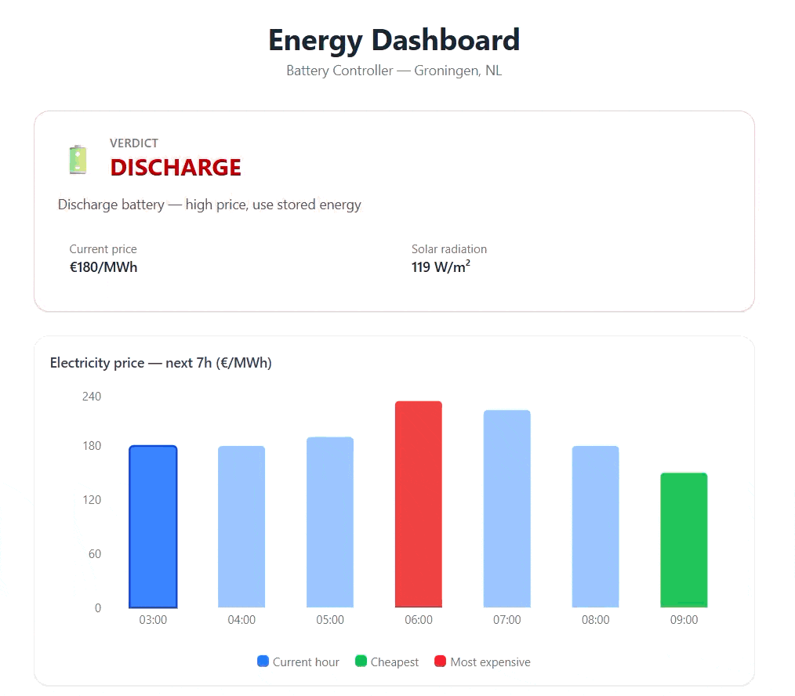

Energy Dashboard ⚡
A smart battery controller dashboard for real-time energy management in Groningen, NL. It visualizes electricity prices and solar radiation forecasts to provide automated CHARGE / DISCHARGE / HOLD decisions.

🚀 Live Demo
https://gabemaldito.github.io/energy-dashboard/

  

🛠️ Tech Stack
Frontend: React 19, TypeScript, Vite 8, Tailwind CSS 4.

Charts: Recharts 3.

Backend: FastAPI (Python), hosted on Railway.

Linting: OxLint.

✨ Features
Verdict Card — Real-time decision making based on current price and solar irradiance.

Dynamic Charts — Interactive visualizations for electricity price (€/MWh) and solar radiation (W/m²).

Live Status — Backend health monitoring with auto-refresh every 5 minutes.

Robust UI — Graceful error handling and loading states.

⚙️ Development
Prerequisites
Node.js 18+

A running backend API.

Installation
Bash
git clone https://github.com/gabemaldito/energy-dashboard.git
cd energy-dashboard
npm install
Environment Variables
Create a .env.local file in the root:

Snippet de código
VITE_API_BASE_URL=http://localhost:8000
Commands
npm run dev — Start development server.

npm run build — Build for production.

npm run lint — Run OxLint.

🏗️ Project Structure
Plaintext
src/
├── api/          # API client and TypeScript interfaces
├── components/   # Reusable UI components
├── App.tsx       # Main state management and polling logic
└── main.tsx      # React entry point
🔌 API Integration
The dashboard consumes the Smart Battery Controller API:

Base URL (Production): https://battery-brain-production.up.railway.app

Key Endpoints:

/api/v1/decision — Battery action and price forecast.

/api/v1/forecast — Solar radiation data.

/health — Service availability check.

🤝 Author
Developed by Gabriel Rapha Costa Cardoso.
